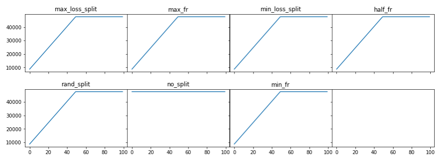
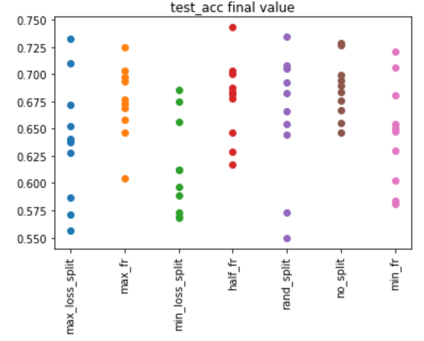
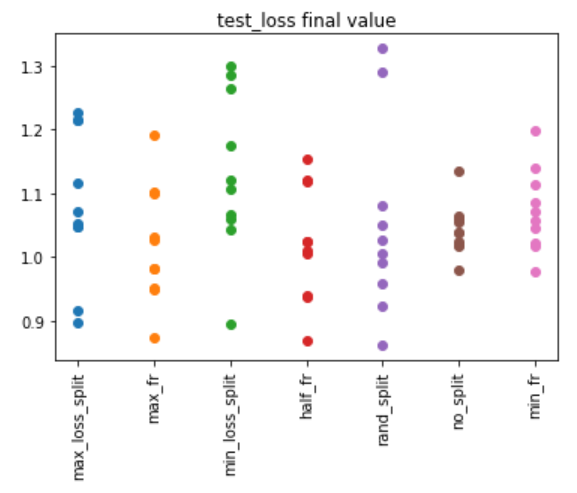

# Neuron Splitting with PyTorch
## Introduction
Most of the deep learning neural nets used nowadays are of a fixed size - the number of neurons and layers doesn't change throughout training, only the model weights change.

In this notebook I'd like to explore splitting a single neuron into 2 new ones, at the end of every epoch (the number 2 was arbitrarily selected, as well as splitting at end of epoch). The split is done randomly in such a way that the 2 new neurons are different from one another (essential for the gradient descent), but while keeping the output - or the next layers activations - identical to what they were before the split.

In this way we are expanding the network without changing it in the immediate moment after the split. But of course the hope is that the split will ultimately change the NN's capabilities/potential after additional training.

Below I experiment with a 3 layer dense fully connected NN - the simplest way to try out this idea. The neurons to be split will always be in the hidden layer, since the input and output have fixed sizes defined by the dataset and the number of classes.

[Randomly splitting a neuron with PyTorch notebook](https://nbviewer.jupyter.org/github/ilaiw/neuron-split/blob/main/neuron-split-2.ipynb)

## A bit of maths
In the following proof I show that when splitting a neuron - or an activation $A^{[i]}$ - we can use 4 positive random variables $\alpha,\beta,\gamma,\delta$, under some constraints, and the network after the split will have the same output as before.
    
What actually is split are the weights and biases before and after this activation (the activation or neuron only exists temporarily as the intermediate values of the input data running through the NN).
    
Consider a 3 layer dense network. 
1. Input layer: $X=A^{[0]}∈R^{N\times C}$
1. Hidden layer $A^{[1]}∈R^{N\times H}$
1. Output layer $Y=A^{[2]}∈R^{N\times M}$
    
Our variables: 
* $N$ = number of samples (batch size)
* $C$ = number of input channels
* $H$ = hidden layer size
* $M$ = output size (number of classes for our 3 layer network)
    
Which means the network weights are:
* $W^{[1]}∈R^{C\times H}$, $b^{[1]}∈R^{H}$
* $W^{[2]}∈R^{H\times M}$, $b^{[2]}∈R^{M}$
    
No activations for now. If we make an analogy to the brain, the synapses are the weights $W^{[i]}$, and the Neurons are the activations $A^{[i]}$.
    
The goal is to randomly split a neuron in $A^{[1]}$ without changing the next activation $A^{[2]}$. 
In other words we go from $A^{[1]}∈R^{N\times H}$ ⇒ $A^{[1]}∈R^{N\times (H+1)}$ while $A^{[2]}$ doesn't change (the indices 1 and 2 can be generalized to i and i+1, but lets keep it simple).

Start with the mathematical definition of a standard dense fully connected layer with no activation (yet):
    
$\\a_{nm}^{[2]} = 
\sum_{h=1}^H a_{nh}^{[1]} w_{hm}^{[2]} +b_{m}^{[2]}= 
\sum_{h=1}^H ( \sum_{c=1}^C x_{nc} w_{ch}^{[1]}+b_{h}^{[1]})w_{hm}^{[2]}+b_{m}^{[2]}$

For simplicity, replace what is inside the sum as $F_h$:

$\\a_{nm}^{[2]} = F_h(1)+...+F_h(i)+...+F_h(H)+b_{m}^{[2]}$

Same as above, but we split the $i_{th}$ neuron into $k,j$:

$\\a_{nm}^{[2] split} = F_h(1)+...+F_h(j)+F_h(k)+...+F_h(H)+b_{m}^{[2]}$

We want the output ($A^{[2]}$) to stay constant after split:

$\\a_{nm}^{[2]}=a_{nm}^{[2] split}⟺F_h(i)=F_h(j)+F_h(k)⇒$

$\sum_{c=1}^C (x_{nc}w_{ci}^{[1]}+b_{i}^{[1]})w_{im}^{[2]}=
\sum_{c=1}^C (x_{nc} w_{cj}^{[1]} +b_{j}^{[1]})w_{jm}^{[2]}+\sum_{c=1}^C (x_{nc} w_{ck}^{[1]} +b_{k}^{[1]})w_{km}^{[2]}
$
$\\\sum_{c=1}^C x_{nc}w_{ci}^{[1]}w_{im}^{[2]}+b_{i}^{[1]}w_{im}^{[2]}=
\sum_{c=1}^C x_{nc}(w_{cj}^{[1]}w_{jm}^{[2]}+w_{ck}^{[1]}w_{km}^{[2]})+ b_{j}^{[1]}w_{jm}^{[2]}+b_{k}^{[1]}w_{km}^{[2]}
$

Above is true when (but not only when. Since $X$ varies, this is the only way forward):

1. $w_{ci}^{[1]}w_{im}^{[2]}=w_{cj}^{[1]}w_{jm}^{[2]}+w_{ck}^{[1]}w_{km}^{[2]}$ 
1. $b_{i}^{[1]}w_{im}^{[2]}=b_{j}^{[1]}w_{jm}^{[2]}+b_{k}^{[1]}w_{km}^{[2]}$

## Methods
### Experiments
* **No split**: This is the experiment's control. Here the hidden layer size is intialized as the max size which the others will reach. So model starts large as opposed to the rest where starts small and expands with splits.
* **Random split**: A random index in the H dimension is selected to split.
* **Split with max loss check**: Using the validation data, the activations in the hidden layer are iterated over and zeroed one at a time - while checking how thiss affects the overall loss. Basically how is the loss affected if I remove a neuron (similar concept to dropout). So we split the neuron that when removed, validation loss is maximized.
* **Split with min loss check**: Same as above but minimum.
* **Split with loss check probs**: Similar to `Split with max loss check`, but with softmax stochastic selection. Skipping this option for now.
* **Split with max fire rate**: Fire rate is how often an neuron (after ReLU) has a non-zero value. Here we select the neuron with the maximal firing rate for the validation dataset.
* **Split with min fire rate**: Same as previous but minimum.
* **Split with .5 fire rate**: The neuron with a fire rate closest to 0.5 is split.

I ran each experiment 10 times, to see repeatability.

### Number of parameters for each experiment, per epoch

## Results

### Test accuracy - final value

### Test loss - final value

## Summary
Surpisingly, the split runs were more variable than the fixed size one.
It seems that the neuron splitting works best with half or max firing rate, but other options also have interesting results. The main problem with this type of network is that it introduces more hyperparameters, but it might be useful in certain applications.
The main issue here seems to be when to split and which neuron to split. None of the methods seemed that great, so maybe these decisions need to be made by a separate NN.

Thank you for reading! Feel free to reach out ilaiwai@gmail.com
