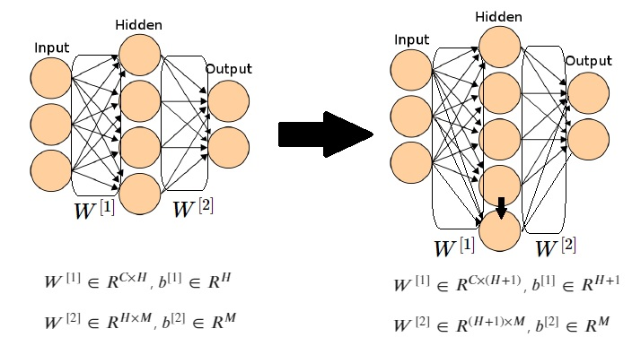

# Neuron Splitting with PyTorch
## Introduction
Most of the deep learning neural nets used nowadays are of a fixed size - the number of neurons and layers doesn't change throughout training, only the model weights change.

In this notebook I'd like to explore splitting a single neuron into 2 new ones, at the end of every epoch (the number 2 was arbitrarily selected, as well as splitting at end of epoch). The split is done randomly in such a way that the 2 new neurons are different from one another (essential for the gradient descent), but while keeping the output - or the next layers activations - identical to what they were before the split.

In this way we are expanding the network without changing it in the immediate moment after the split. But of course the hope is that the split will ultimately change the NN's capabilities/potential after additional training.

Below I experiment with a 3 layer dense fully connected NN - the simplest way to try out this idea. The neurons to be split will always be in the hidden layer, since the input and output have fixed sizes defined by the dataset and the number of classes.

[Randomly splitting a neuron with PyTorch notebook](https://nbviewer.jupyter.org/github/ilaiw/neuron-split/blob/main/neuron-split-2.ipynb)

